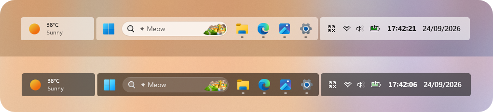

# ✦ TaskbarXII theme for Windows 11 Taskbar Styler :3

**Author**: [ryokr](https://github.com/ryokr)



## Suggested Windows settings

- Use the default taskbar alignment (center).
- You can hide the bell icon via Notifications in Settings.
- This theme is not compatible with **Vertcal Taskbar**.

## Theme selection

The theme is integrated into the mod and can be selected directly from the mod's
settings:

* Open the Windows 11 Taskbar Styler mod in Windhawk.
* Go to the "Settings" tab.
* Select TaskbarXII theme and save the settings.

## Manual installation

The theme styles can also be imported manually. To do that, follow these steps:

* Open the Windows 11 Taskbar Styler mod in Windhawk.
* Go to the "Settings" tab and select "Textual mode".
* Copy the content below to the text box and click "Save settings".

## With Widget Separated

The Widget should be always enabled in taskbar setting.


<details>
<summary>Content to import (click to expand)</summary>

```yaml
controlStyles:
  - target: ScrollViewer > ScrollContentPresenter > Border > Grid
    styles:
      - Background:=<AcrylicBrush TintColor="{ThemeResource SystemListLowColor}" TintOpacity="0.1" FallbackColor="{ThemeResource SystemChromeHighColor}" />
      - ColumnDefinitions:=<ColumnDefinitionCollection><ColumnDefinition Width="*"/><ColumnDefinition Width="Auto"/><ColumnDefinition Width="4"/><ColumnDefinition Width="Auto"/><ColumnDefinition Width="*"/></ColumnDefinitionCollection>
  - target: Taskbar.TaskbarFrame
    styles:
      - Grid.Column=1
      - HorizontalAlignment=Right
      - Height=56
  - target: Taskbar.TaskbarFrame > Grid
    styles:
      - Height=48
      - CornerRadius=4
  - target: Taskbar.TaskbarBackground#BackgroundControl
    styles:
      - Transform3D:=<CompositeTransform3D TranslateX="156.5"/>
      - Opacity=0.7
      - Height=48
  - target: Taskbar.TaskbarBackground > Grid
    styles:
      - CornerRadius=4
      - Opacity=1
  - target: Windows.UI.Xaml.Shapes.Rectangle#BackgroundStroke
    styles:
      - Height=0
  - target: Microsoft.UI.Xaml.Controls.ItemsRepeater#TaskbarFrameRepeater
    styles:
      - Margin=0,0,3,0
  - target: Taskbar.AugmentedEntryPointButton > Taskbar.TaskListButtonPanel
    styles:
      - Background:=<SolidColorBrush Color="{ThemeResource SystemChromeAltHighColor}" Opacity="0.6" />
      - CornerRadius=4
      - Padding=0
      - Margin=0,0,8,0
  - target: Taskbar.AugmentedEntryPointButton > Taskbar.TaskListButtonPanel > Grid
    styles:
      - Margin=8,0,0,0
  - target: Border#LargeTicker1
    styles:
      - Margin=0,2,4,0
  - target: Border#LargeTicker1 > AdaptiveCards.Rendering.Uwp.WholeItemsPanel > Image
    styles:
      - MaxHeight=27
      - MaxWidth=27
  - target: Border#LargeTicker1 > AdaptiveCards.Rendering.Uwp.WholeItemsPanel > Microsoft.UI.Xaml.Controls.AnimatedVisualPlayer
    styles:
      - MaxHeight=27
      - MaxWidth=27
  - target: SearchUx.SearchUI.SearchButtonRootGrid#SearchBoxButtonRootPanel
    styles:
      - Margin=4,0,8,0
  - target: TextBlock#SearchBoxTextBlock
    styles:
      - Text=✦ Meow
  - target: SystemTray.SystemTrayFrame
    styles:
      - Grid.Column=3
      - HorizontalAlignment=Left
      - VerticalAlignment=Center
  - target: StackPanel#SystemTrayFrameGrid
    styles:
      - Background:=<SolidColorBrush Color="{ThemeResource SystemChromeAltHighColor}" Opacity="0.6" />
      - CornerRadius=4
      - Padding=8,3,0,3
  - target: TextBlock#InnerTextBlock[Text=]
    styles:
      - Text=
  - target: SystemTray.DateTimeIconContent > Grid > StackPanel
    styles:
      - Orientation=Horizontal
      - Spacing=12
  - target: TextBlock#TimeInnerTextBlock
    styles:
      - FontSize=15
      - FontWeight=Bold
  - target: TextBlock#DateInnerTextBlock
    styles:
      - FontSize=15
      - FontWeight=SemiBold
```
</details>

## Without Widget Separated

The Widget no need to be enabled in taskbar setting.


<details>
<summary>Content to import (click to expand)</summary>

```yaml
controlStyles:
  - target: ScrollViewer > ScrollContentPresenter > Border > Grid
    styles:
      - Background:=<AcrylicBrush TintColor="{ThemeResource SystemListLowColor}" TintOpacity="0.1" FallbackColor="{ThemeResource SystemChromeHighColor}" />
      - ColumnDefinitions:=<ColumnDefinitionCollection><ColumnDefinition Width="*"/><ColumnDefinition Width="Auto"/><ColumnDefinition Width="4"/><ColumnDefinition Width="Auto"/><ColumnDefinition Width="*"/></ColumnDefinitionCollection>
  - target: Taskbar.TaskbarFrame
    styles:
      - Grid.Column=1
      - HorizontalAlignment=Right
      - Height=56
  - target: Taskbar.TaskbarFrame > Grid
    styles:
      - Height=48
      - CornerRadius=4
  - target: Taskbar.TaskbarBackground#BackgroundControl
    styles:
      - Height=48
      - Opacity=0.7
  - target: Taskbar.TaskbarBackground > Grid
    styles:
      - CornerRadius=4
      - Opacity=1
  - target: Windows.UI.Xaml.Shapes.Rectangle#BackgroundStroke
    styles:
      - Height=0
  - target: Microsoft.UI.Xaml.Controls.ItemsRepeater#TaskbarFrameRepeater
    styles:
      - Margin=3,0,3,0
  - target: Taskbar.AugmentedEntryPointButton > Taskbar.TaskListButtonPanel
    styles:
      - Margin=-4,0,0,0
  - target: Border#LargeTicker1
    styles:
      - Margin=0,2,4,0
  - target: Border#LargeTicker1 > AdaptiveCards.Rendering.Uwp.WholeItemsPanel > Image
    styles:
      - MaxHeight=27
      - MaxWidth=27
  - target: Border#LargeTicker1 > AdaptiveCards.Rendering.Uwp.WholeItemsPanel > Microsoft.UI.Xaml.Controls.AnimatedVisualPlayer
    styles:
      - MaxHeight=27
      - MaxWidth=27
  - target: SearchUx.SearchUI.SearchButtonRootGrid#SearchBoxButtonRootPanel
    styles:
      - Margin=4,0,8,0
  - target: TextBlock#SearchBoxTextBlock
    styles:
      - Text=✦ Meow
  - target: SystemTray.SystemTrayFrame
    styles:
      - Grid.Column=3
      - HorizontalAlignment=Left
      - VerticalAlignment=Center
  - target: StackPanel#SystemTrayFrameGrid
    styles:
      - Background:=<SolidColorBrush Color="{ThemeResource SystemChromeAltHighColor}" Opacity="0.6" />
      - CornerRadius=4
      - Padding=8,3,0,3
  - target: TextBlock#InnerTextBlock[Text=]
    styles:
      - Text=
  - target: SystemTray.DateTimeIconContent > Grid > StackPanel
    styles:
      - Orientation=Horizontal
      - Spacing=12
  - target: TextBlock#TimeInnerTextBlock
    styles:
      - FontSize=15
      - FontWeight=Bold
  - target: TextBlock#DateInnerTextBlock
    styles:
      - FontSize=15
      - FontWeight=SemiBold
```
</details>